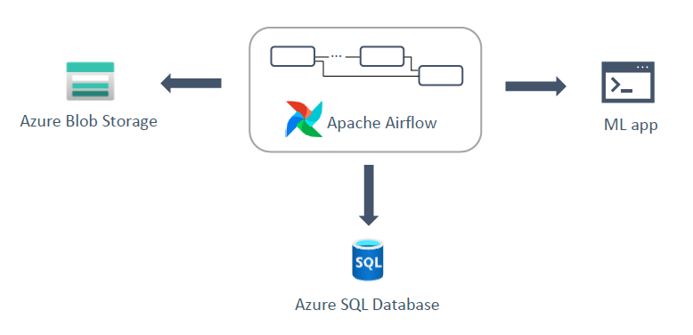
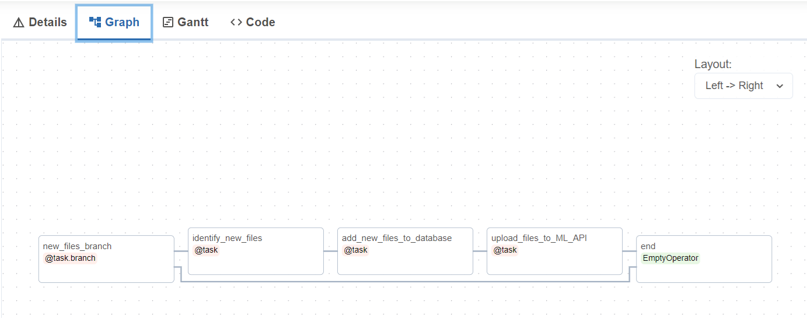

# Introduction to the project
The purpose of this small sandbox project is to use Airflow to automate file uploads to a Machine Learning app's database.
That app, accessible via a REST API, anwsers topic-specific questions about the files in its database.

Astronomer is used to manage the Airflow instance.

Other technologies used are: Azure SQL Database and Azure Blob Storage.

# Solution structure
The solution has the following architecture: 

It consists of an Airflow DAG which connects to: 
- an Azure Blob Storage to check for new files,
- to the ML app's API to upload the files,
- and to an Azure SQL Database to keep track of the available and uploaded files.

The code for this solution is in the dags folder, divided in 4 files:

- In the connectors subfolder:
  One file for each external resource used: ML API, Azure SQL Database and Azure Blob Storage.
  In each of them, there are:
  - class attributes for common information, such as the connection id, container id, etc.
  - instance attributes for the hook used.
  - methods to initialize the hook and perform operations in the resources, such as query a table, use a REST endpoint, etc.

- The dag file:
  - task definitions
  - dag definition

The script to create the table used in the database is also provided, in the "create processed_file table script.sql" file:

- An auto-numerical primary key was used.
- A unique constraint was added to the file_name field, as that is the one used to identify the files in the Blob Storage and ML app.
    
## Tasks Logic

- **new_files_branch**:
  It queries the list of files in the blob storage, and compares its length with the number of files in the storage from the previous run.
  If the number of files currently available in the blob storage hasn't increased, the dag run ends.
- **identify_new_files**:
  The list of files in the blob storage and database are compared, and the newly added files in the blob storage are identified.
- **add_new_files_to_database**:
  These new files are added to the database, and the number of files for future runs is updated.
- **upload_files_to_ML_API**:
  The files are formatted and loaded into the API, and their status is updated accordingly in the database. 
- **end**:
  Dummy task to identify the end of the process.

In the Graph View of the DAG, wa can see the dependencies between the tasks, apart from their type:

## Airflow Resources
Connections to the ML API, Azure SQL Database and Azure Blob Storage were configured in the Airflow UI.
Also, some variables were defined in the UI too, to save the number of files that were found in the Blob Storage in previous runs of the DAG.

### Connections
- id: "Http_Sandbox", type: HTTP  
  host also specified.
- id: "Blob_Sandbox", type: Azure Blob Storage (wasb)  
  blob storage login and key also specified.
- id: "SQL_Sandbox", type: Microsoft SQL Server (mssql)  
  host, schema, login, password and port also specified.

### Variables
- count_files_in_blob
- count_files_in_blob_stg

# Considerations
Some considerations were made in the code regarding the idempotency of the tasks, as well as the number of times each of them sould be retried.

## Idempotency

- **upload_files_to_ML_API**:
  The files to be updated to the API (with "in blob" status) is queried from the database, before sending them to the API,
  to avoid any retries on this task allows to re-upload duplicated files.
  One case in which an already uploaded file can be uploaded again is when the *send_upload_request(f)* method succeeded, but not the
  *update_status_for_uploaded_files(f['path'])* one. But, in this example, we do not have access to an endpoint in the API to check the files already
  uploaded in it.
  
- **upload_files_to_ML_API**:
  The files are sent to the API and the database status is updated within the same for loop because, in case one of the inserts fails, only its status won't
  be updated.

## Retries

The default retry number for each task is defined as 1, but for some tasks this number was overwritten:

- **add_new_files_to_database**:
  It has 0 retries because we prefer to re-start the whole dag again in case of failure.
  The event of the database connection not being successful is unlikely, given that it was successful in the previous tasks,
  but the insert statement could also fail, and it could fail on any file. So, the files_dict calculated in the previous task may not be accurate on a second run
  of the task, it could contain files that were already inserted in the database.
  Changes can be made to the dag logic to prevent this, but we preferred the simplicity of the current logic, and we think the insert errors won't be frequent.
  
- **upload_files_to_ML_API**:
  It has 3 retries because, in this case, this is a resource we have no control over.
  It is assumed that the API could be unstable, and having an error as response the first times could not mean the resource is not available permanently.
  The endpoint calls are not costly in time, so we can afford to retry some more times.
  This may be re-evaluated as the dag runs for some time, and it may be the case that the API only errors out when there is a recurrent problem, so the number of
  retries should be smaller.

# Running this project

The code in this repo is not containarized, so it is not ready for readers to be able to run it directly if they clone it. Its purpose is to share the logic of the DAG, and that the code could serve as a template or starting point for other development.

The Dockerfile and tests folder are the default ones provided by Astronomer.
The requirements file was empty by default, so the provider for MSSQL had to be added. 

One quick way of running the code locally will be to:
- Set up a local Airflow instance using Astro, or use your already configured instance.
- Copy the following folders in the corresponding hierarchy:
  - connectors folder and all its files,
  - airflow_azure_sandbox_dag.py
  - requirements.txt
